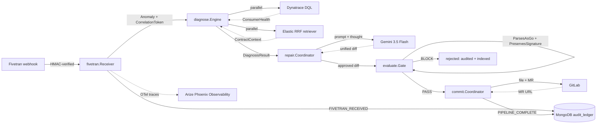

# Kineticz

High-performance, deterministic DataOps orchestration. Detects broken data pipelines, diagnoses the root cause with Gemini 3.5 Flash, gates the patch with a local go/parser + go/ast check, and lands it via GitLab merge request. Arize Phoenix traces every stage over OpenTelemetry. Every step is hash-chained and Ed25519-signed in MongoDB Atlas.

## Problem

Upstream schema changes break downstream consumers silently. On-call engineers spend hours triaging when the fix is a one-line diff.

## Architecture



## Quickstart

```sh
git clone https://github.com/skunkworks0x/kineticz && cd kineticz
cp .env.example .env && $EDITOR .env   # populate all required vars (see file)
go test -race ./... && go test -race -tags=integration ./...
docker build -t kineticz .
docker run --env-file .env -p 8080:8080 kineticz
```

The integration test wires all six external partners with mocks and exercises
the full pipeline end-to-end; it is gated behind the `integration` build tag.

## How it works

**Detect.** Fivetran webhook delivers a schema-change event. `fivetran.Receiver` verifies HMAC-SHA256 against the shared secret, deduplicates by event ID against MongoDB, mints a `CorrelationToken`, and writes `FIVETRAN_RECEIVED` before handing off to a background pipeline goroutine.

**Diagnose.** `diagnose.Engine` fans out two calls under a 5-second timeout via a buffered channel of capacity 2. Elastic returns the contract YAML and top-3 historical mitigations via Reciprocal Rank Fusion (BM25 on column names + KNN on diff embeddings, `rank_constant=60`). Dynatrace returns downstream consumer health via DQL. Elastic failure is hard fail; Dynatrace `ErrTelemetryUnavailable` is soft fail (Degraded mode).

**Repair.** `repair.Coordinator` runs up to 4 iterations. Each iteration refreshes the target file buffer, prompts Gemini 3.5 Flash with contract + target + mitigations + previous feedback, parses the response with `bluekeyes/go-gitdiff`, and rejects on multi-file, binary, empty hunks, path traversal, or two consecutive empty responses.

**Evaluate.** `evaluate.Gate` runs the local pre-filter first: patched bytes must parse as Go (`go/parser`) and exported function signatures must remain unchanged (`go/ast`). Local BLOCK skips downstream stages entirely. On local pass, Phoenix records the verdict as a trace span for observability. Rejected diffs are deduplicated by SHA-256 and indexed into Elastic in a detached goroutine.

**Commit.** `commit.Coordinator` pushes the post-patch file content to a GitLab branch named `kineticz/<correlation_token>`, then opens a merge request. The MR description prepends `X-Correlation-Token: <token>` so the audit ledger joins to the MR thread. Audit emits `COMMIT_OK` and `MR_CREATED` as distinct entries so the ledger pinpoints which half failed if one does.

**Audit.** Every transition writes an `audit.Entry` chained to the previous hash and signed with Ed25519. The hash covers `PreviousHash || Action || Payload || Thought || Timestamp` with 8-byte big-endian length prefixes. Tampering with any byte invalidates the chain.

## Partner integrations

Kineticz orchestrates in Go. The diagnose engine fans Dynatrace and Elastic
out in two goroutines under one 5-second deadline, then the repair coordinator
calls Gemini with both results in the prompt for the patch reasoning step.

| Partner | Role | Integration |
|---|---|---|
| Fivetran | Schema-change source | HMAC-verified inbound webhook |
| Dynatrace | Consumer health telemetry | DQL query, REST |
| Elastic | Contract store + mitigation retrieval (RRF) | `_doc` GET + `_search` retriever block, REST |
| Gemini 3.5 Flash | Patch reasoning + generation | Vertex AI `generateContent` REST, OAuth |
| Arize | Observability + tracing | OpenTelemetry via Phoenix |
| GitLab | Patch application | v4 REST: commits + merge_requests |
| MongoDB Atlas | Hash-chained audit ledger | mongo-driver v2, ACID transactions |

## Audit chain

`internal/audit` defines a length-prefixed canonical encoding so two implementations can compute the same SHA-256 without coordination. `audit.Chain` signs with Ed25519; `audit.Verify` checks linkage, hash, and signature. The MongoDB writer wraps every Append in a transaction so cross-process concurrent writes either chain cleanly or fail. The signing seed is loaded from `KINETICZ_ED25519_SEED` so restarts continue the chain with the same key; the matching public key is upserted into the `kineticz_meta` collection at startup AND served at `GET /audit/pubkey` so external verifiers can fetch it without trusting the running process. Timestamps are truncated to millisecond precision before signing to survive the BSON DateTime roundtrip. See `internal/audit/audit.go` and `internal/audit/mongodb/` for details.

## License

MIT. See [LICENSE](./LICENSE).

