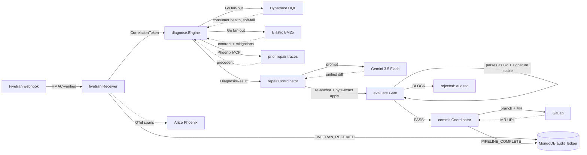

# Kineticz

Kineticz detects broken data pipelines from Fivetran schema-change events,
diagnoses each one from retrieved contract history and its own prior repairs,
prompts Gemini 3.5 Flash for a patch, re-anchors and gates that patch locally,
and opens a GitLab merge request for human review. Every step is hash-chained
and Ed25519-signed in MongoDB Atlas.

## Problem

Upstream schema changes break downstream consumers without warning. On-call
engineers spend hours triaging when the fix is a one-line diff.

## Architecture



The diagnose engine fans out its tool calls with Go goroutines. Gemini generates
the patch from the assembled prompt; it does not route the tool calls.

## How it works

**Detect.** A Fivetran webhook delivers a schema-change event. `fivetran.Receiver`
verifies HMAC-SHA256 with a constant-time compare against the shared secret,
deduplicates by event ID against MongoDB, mints a `CorrelationToken`, writes
`FIVETRAN_RECEIVED`, and hands off to a background pipeline goroutine. A
repair-triggering event returns `202 Accepted` with the correlation token in the
body. A duplicate or non-repair event returns `200`.

**Diagnose.** `diagnose.Engine` fans out two Go goroutines under a 5-second budget
through a buffered channel of capacity 2. Elastic returns the contract YAML and
top historical mitigations by BM25 over the connector signature. Dynatrace returns
downstream consumer health by DQL. The engine also queries the Arize Phoenix MCP
server for the agent's own prior repair traces on this contract and folds them
into the prompt as precedent. Elastic failure is a hard fail. Dynatrace and
Phoenix failures are soft fails, and the diagnosis proceeds in degraded mode.

**Repair.** `repair.Coordinator` runs up to 4 iterations. Each iteration refreshes
the target file from GitLab, prompts Gemini 3.5 Flash with the contract, the
target file, the retrieved mitigations, the prior repairs, and the previous
feedback, then parses the response with `bluekeyes/go-gitdiff`. Gemini's hunk line
numbers are not trusted. The coordinator re-anchors each hunk to its unique exact
context match in the target file, or rejects the diff fail-closed on a zero,
non-unique, or unanchorable match. The applier is byte-exact.

**Evaluate.** `evaluate.Gate` runs locally. The patched bytes must parse as Go
(`go/parser`) and exported function signatures must stay unchanged (`go/ast`). The
gate is syntactic. It proves the patch compiles and preserves exported signatures.
It does not prove behavioral correctness. The human who reviews the merge request
provides the semantic check. Phoenix records the verdict as a trace span. Rejected
diffs are audited.

**Commit.** `commit.Coordinator` pushes the patched file to a GitLab branch named
`kineticz/<correlation_token>`, then opens a merge request. The description
prepends `X-Correlation-Token: <token>` so the audit ledger joins to the MR thread.
`COMMIT_OK` and `MR_CREATED` are distinct ledger entries, so the ledger pinpoints
which half failed if one does.

**Audit.** Every transition writes an `audit.Entry` chained to the previous hash and
signed with Ed25519. The hash covers `PreviousHash || Action || Payload || Thought
|| Timestamp` with 8-byte big-endian length prefixes. `audit.Verify` checks
linkage, hashes, and signatures. Interior tampering is detected. Tail-truncation
needs an external count anchor to detect, and the verifier reports that boundary.

## Self-introspection through Phoenix MCP

At diagnosis time Kineticz queries the Phoenix MCP server for `kineticz.repair`
spans on the current contract and folds the verdicts and iteration counts of its
own prior repairs into the next prompt as precedent. On a later run on
`postgres/orders_pg`, the diagnosis pulled the agent's two prior repairs on the
contract, a failure (`MAX_ITERATIONS`, 4 iterations) and a success (`APPROVED`,
1 iteration), and the new patch approved. When Phoenix is unreachable the
leg degrades and the diagnosis proceeds. This is the partner MCP integration:
Kineticz introspects its own trace history through Arize Phoenix.

The Dockerfile bakes the phoenix-mcp server (`@arizeai/phoenix-mcp`, pinned)
into the container image. The Go binary spawns it as a node subprocess inside
the same container and speaks MCP over stdio, so a request to the hosted Cloud
Run URL exercises the full MCP path with no sidecar or separate service.
Without Phoenix the diagnose stage writes `PHOENIX_HISTORY_DEGRADED` to the
audit ledger and the run still returns `PIPELINE_COMPLETE`.

## Partner integrations

| Partner | Role | Integration | Live status |
|---|---|---|---|
| Fivetran | Schema-change source | HMAC-verified inbound webhook | live |
| Gemini 3.5 Flash | Patch generation | Vertex AI `generateContent` REST, metadata-server auth | live |
| Elastic | Contract and mitigation retrieval | BM25 over the connector signature | live (BM25 only) |
| Dynatrace | Soft-fail downstream-consumer-health source | DQL over REST | soft-fail demo, no live tenant |
| Arize Phoenix | Observability and self-introspection | OpenTelemetry spans, Phoenix MCP for prior-repair queries | live |
| GitLab | Patch application | v4 REST: branch commit and merge request | live |
| MongoDB Atlas | Tamper-evident audit ledger | hash-chained, Ed25519-signed, ACID writes | live |

Arize Phoenix is the observability and tracing spine and the partner-track
integration. Kineticz calls Dynatrace and Elastic over REST, not MCP.

## Audit chain

`internal/audit` defines a length-prefixed canonical encoding so two
implementations compute the same SHA-256 without coordination. `audit.Chain` signs
with Ed25519. `audit.Verify` checks linkage, hash, and signature. The MongoDB
writer wraps every Append in a transaction so concurrent writes either chain
cleanly or fail. The signing seed loads from `KINETICZ_ED25519_SEED` so restarts
continue the chain with the same key. The matching public key is upserted into the
`kineticz_meta` collection at startup and served at `GET /audit/pubkey`, so an
external verifier fetches it without trusting the running process. Timestamps
truncate to millisecond precision before signing to survive the BSON DateTime
roundtrip. See `internal/audit/audit.go` and `internal/audit/mongodb/`.

## Boundaries

Stated plainly, because they shape what every claim above means:

- The gate is syntactic. It checks that the patch compiles and keeps exported
  signatures stable. It does not check behavior. The MR reviewer does.
- Retrieval is BM25 in the deployed environment. The dense vector leg (KNN over
  diff embeddings via reciprocal rank fusion) is wired but inactive without a
  provisioned Elastic ML node.
- Dynatrace runs in soft-fail mode. The demo environment has no Dynatrace tenant,
  so consumer-health lookups degrade and the diagnosis proceeds without them.
- Gemini's patch generation is probabilistic at temperature 0.2. "Deterministic"
  in this project describes the gate and the audit chain, not the patch.
- Tail-truncation of the audit chain needs an external count anchor to detect.

## Quickstart

```sh
git clone https://github.com/skunkworks0x/kineticz && cd kineticz
cp .env.example .env && $EDITOR .env   # populate all required vars (see file)
go test -race ./... && go test -race -tags=integration ./...
docker build -t kineticz .
docker run --env-file .env -p 8080:8080 kineticz
```

The integration test covers the happy path and the Phoenix-unreachable path with
interface mocks, behind the `integration` build tag. The live end-to-end runs, a
real Fivetran webhook through Gemini, the GitLab MR, and the Atlas ledger, are the
full-pipeline evidence.

## License

MIT. See [LICENSE](./LICENSE).
